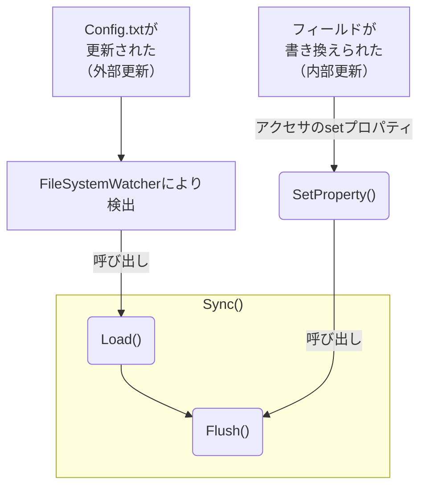

# Configについて

UIに頼らず，パラメーターの調整が可能です．  
独立したテキストファイル`Config.txt`に設定値を保存します．  
それ故に，ゲームが終了しても設定値が失われません．
> [!NOTE]
> このスクリプトは`MonoBehaviour`を継承せず，`static`なクラスとして実装されています．  
> 故にUnityのシーンロードなどには影響を受けず，別スレッドで独立して動きます．  
> **通常UnityのGameObjectには干渉できません**が，メインスレッドに処理を投げることで解決できます．

## Configを使うには
例えば，ログに設定値を出したいなら，
```csharp
Debug.Log(Config.OverridePilotMass);
```
とすれば良いです．

設定値を変更したいなら，
```csharp
Config.OverridePilotMass = 60.0f;
```
と普通に代入するだけで，`Config.txt`の値も更新されます．

簡単で便利でしょ？

## Configを追加するには
1. `Config.cs`を開く．
2. 新しく初期値とフィールド，アクセサを追加する．
  ```csharp
  private static readonly float defaultOverridePilotMass = 0.0f; // 初期値
  private static float overridePilotMass = defaultOverridePilotMass; // フィールド
  public static float OverridePilotMass // アクセサ
  {
      get => overridePilotMass; // フィールドを参照
      set => SetProperty(ref overridePilotMass, value); // フィールドを更新
  }
  ```
3. `Load()`内に`CheckContent()`関数による代入式を追加する．
  ```csharp
  overridePilotMass = CheckContent("OverridePilotMass", defaultOverridePilotMass);
  ```
4. `Flush()`内に`Config.txt`に書き込む処理を追加する．
  ```csharp
  addString($"パイロットの体重の上書き[kg](初期値: {defaultOverridePilotMass:0.0})"); // 説明の書き込み
  addConfig("OverridePilotMass", OverridePilotMass.ToString()); // Configの書き込み
  newLine(); // 改行
  ```

# 処理の流れ
