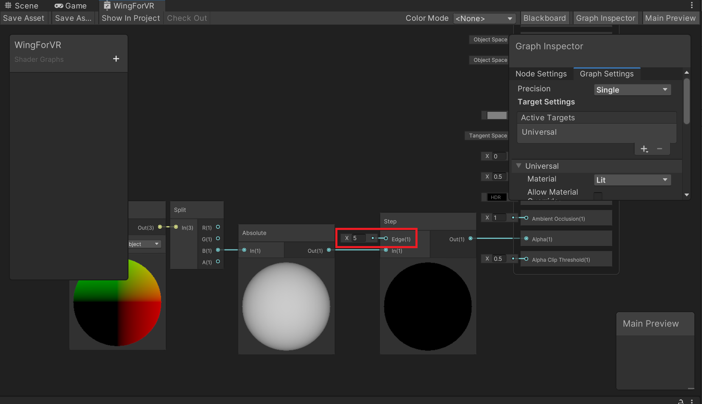
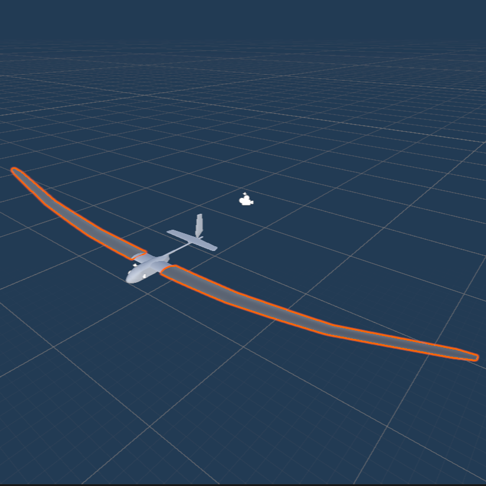
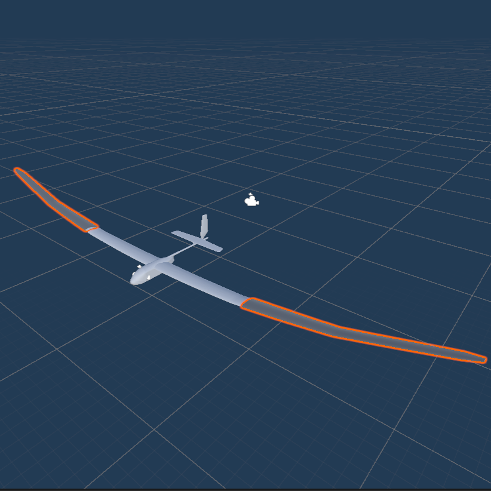

# 機体の3Dモデルについて

`Tatsumi`だけ，機体のモデルが二重に重なっています．
- 三人称視点での表示用（`Main2`）
- VR映像での翼端確認用（`WingForVR`）
です．

`Shader Graph`を使用して，機体の中心から左右1mを透明にしています．  
透明にする距離を変更する場合は，`Step`の`Edge`を調整してください．

||
|:--:|
|`Shader Graph`の`Edge`を5mにした例|

|||
|:--:|:--:|
|`Shader Graph`の`Edge`を1mにした例|`Shader Graph`の`Edge`を5mにした例|