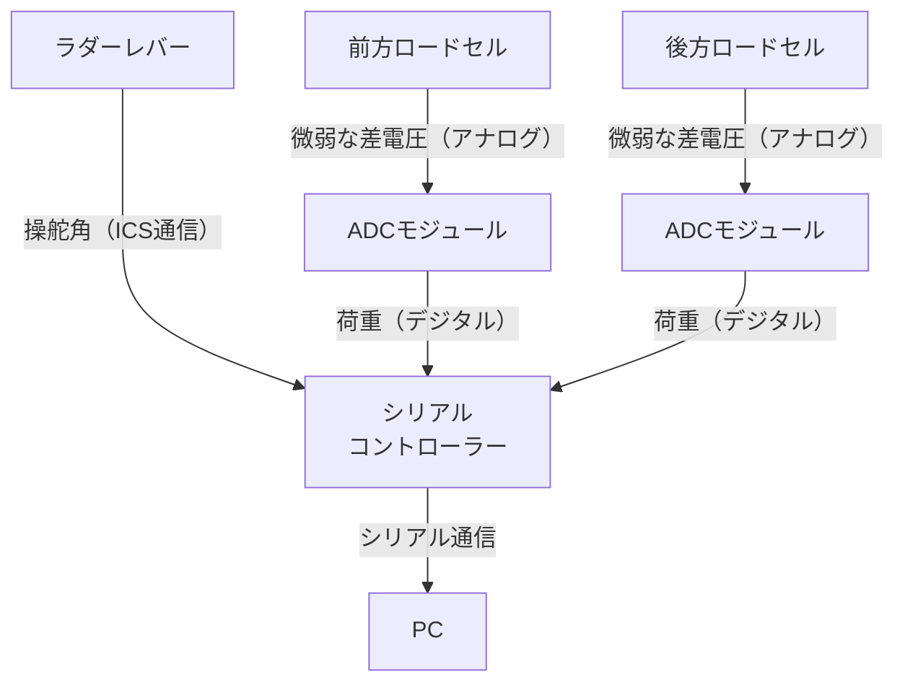

# シミュデバイスについて
シミュソフトを実行中のPCに対してシリアル通信を行う周辺機器側を「シミュデバイス」と呼ぶことにします．

## シミュデバイスの構成
- [ロードセル シングルポイント(ビーム型) SC601 120kg](https://akizukidenshi.com/catalog/g/g112035/) - 2個
  - 秋月に売っているどのロードセルとも違い，ケーブルの根本がとても太い（理由のほとんどはこれ）．
- ADCモジュール - 2個 
  - [HX711使用 ロードセル用ADコンバーター モジュール基板](https://akizukidenshi.com/catalog/g/g112370)ベースの自作モジュール
  - これはデータレートが10Hzだが，HX711の最大データレートは80Hzまで引き出せる．
  - 基板は後輩に作ってもらい，[HX711](https://akizukidenshi.com/catalog/g/g112473/)をIC単体で購入し，ホットプレートでリフローした．
- ラダーレバー - 左右1個ずつ
  - 実機と同じものを用意した（これは故障時の予備でもあった）．
  - ICS通信についての詳細は[近藤化学の解説サイト](https://kondo-robot.com/faq/ics3-5-explain)を参照してほしい．
- シリアルコントローラー - 1個
  - ADCモジュールからの通信を読み取っている（[秋月のサンプルを参照](https://akizukidenshi.com/goodsaffix/ae_hx711.zip)）．
  - `TORICA_ICS`というライブラリを利用してICS通信を解析している．
    - この処理は`loop1()`で実行されており，別Coreで並列処理している．
    - これには理由があり，ICS通信を待ち受ける時間が多少かかるようで，この処理が`loop()`内の`Serial`と同時におこなわれると，Unity側での受信タイミングがずれて通信できなくなることがあったためである．
  - データは以下の構造の文字列で送信している（通常のArduino関数`Serial.println()`によるUSBシリアル通信）．
    ```
    [前方荷重], [後方荷重], [ラダーの制御値]
    ```


## 目次
- [マイコンのソフトウェアについて](シミュデバイスに関する詳細/マイコンのソフトウェアについて.md)
- [回路や接続について](シミュデバイスに関する詳細/回路や接続について.md)
- [フレーム保持構造について](シミュデバイスに関する詳細/フレーム保持構造について.md)
