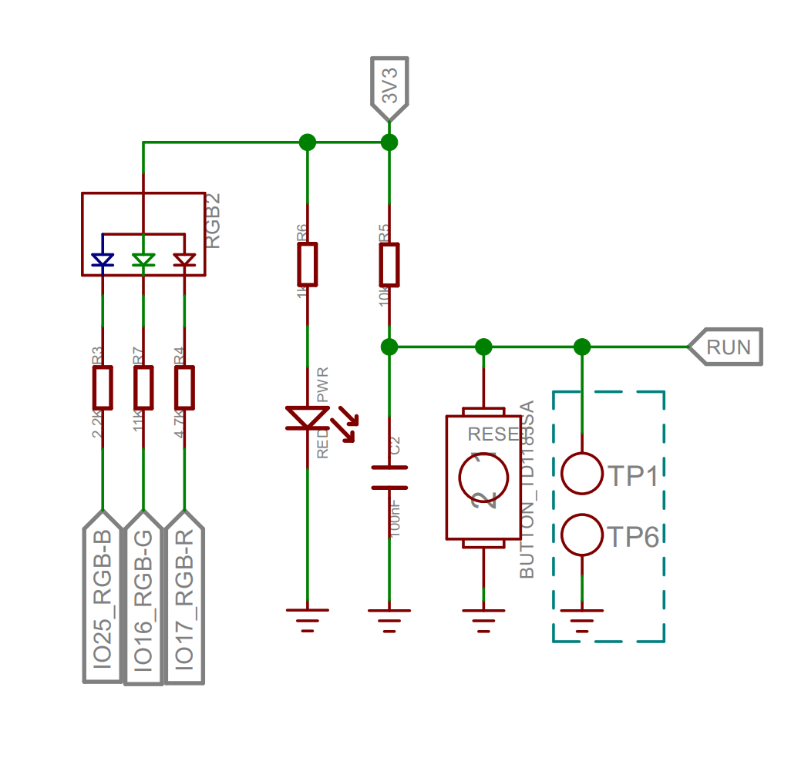

# マイコンのソフトウェアについて

電装にあまり関われていない人向けに，少々丁寧に書かせてもらいます．

[マイコンのソフトウェアのソース](https://github.com/torica-org/torica-sim2026-devices/tree/main/Software)

## 書き込み方法
幸い[とてもわかり易い公式ドキュメント](https://wiki.seeedstudio.com/ja/XIAO-RP2040/)があります．  
これを読めば迷うことは無いでしょう．

## 解説

### ライブラリの読み込み
```cpp
#include <Arduino.h>
#include <TORICA_ICS.h>
```
- Arduino.h：Arduinoの基本的な機能を提供するライブラリ
- TORICA_ICS.h：ICS通信を解析する鳥科独自ライブラリ

### LED制御とリセット
```cpp
//RUN(30)ピンをLOWにすることでリセット可能
#define READY_LED 22
```
実はこの記述無意味です．XIAO RP2040のGPIO22は使用できません．

LEDの実装も特殊で，RGBの三色があるほか，`LOW`にすることで点灯します．

||
|:--:|
|XIAO RP2040のLEDの実装|

また，リセットのための`RUN`ピンも使用できません．  
もう一度`setup()`関数を呼び出して，初期化をやり直してリセットするのが良いでしょう．

### プロトタイプ宣言
```cpp
//プロトタイプ宣言
long LoadCell_Read(int pin_slk, int pin_dout);
long LoadCell_Averaging(long adc, char num);
float LoadCell_getGram(char num);
```

### ロードセル関連の定数
```cpp
//---------------------------------------------------//
// ロードセル　シングルポイント（ ビーム型）　ＳＣ６０１　１２０ｋＧ [P-12035]
//---------------------------------------------------//
#define OUT_VOL   0.002f      //定格出力 [V] : 2mV/V
#define LOAD      120000.0f   //定格容量 [g] : 120kg
```
ロードセルのデータシートや秋月の販売ページで確認できる値です．  
定格出力は，ロードセルへ入力された電圧1V当たりの，最大負荷時の出力差電圧です．  
例えば，このロードセルに5Vを入力，120kgを負荷した場合，出力差電圧は以下のようになります．

$ V_{out} = 5 \cdot OUT_VOL = 0.01V $

### ピン指定
```cpp
// forward, backward
int pin_slk[4] = {D3, D7};
int pin_dout[4] = {D4, D8};

constexpr uint8_t ICS_SIG = D6; // ICS通信受信ピン
SerialPIO rudder(D9, ICS_SIG); // 送信ピンは使わないので，使用しないピンを適当に指定
```
色々と適当です．基板が変わったら当然変える必要があります．  
RP2040にはPIOという最強の仕組みがあるので，どのピンでも安定してUARTを使うことができます．　　
### TORICA_ICS
以下のようにインスタンス化します．
```cpp
TORICA_ICS ics(&rudder);
```
ICS通信の値は以下のように取得します．
```cpp
//====以下，ラダー取得のための処理====

void setup1() {}

// 時間のかかる処理がUnityのシリアル通信を失敗させることがある．
// それを回避するため，別Coreで並列処理する．
void loop1() {
  int val = ics.read_Angle(); // これには多少の時間がかかる．
  if (val != 0.0) {
    servo_pos = val;
  }
  // Serial.println(servo_pos);
  delay(100);
}
```
記述にある通り，Unityで安定してシリアル通信を読み取るために，別Coreで処理させています．
```cpp
//=====サーボのポジションのグローバル変数=====//
//servo_pos:
// (L)30°<=> 0°(N)<=> -30°(R)
//   8389<=> 7500 <=> 6611
volatile int servo_pos = 7500; //こちらでは最適化を抑制するため，確実に更新される
//=====================================//
```
そのため，`volatile`を使っています．  
こうすることで，最適化が抑制され，servo_posの値が常に正しく更新されるようになります．

### オフセットの取得（void setup()内）
```cpp
  // オフセットを取得
  for (int i = 0; i < 2; i++) {
    float sum = 0;
    for (int j = 0; j < 10; j++) {
      sum += AE_HX711_getGram(pin_slk[i], pin_dout[i]);
    }
    offset[i] = sum / 10;
    Serial.print("Resetting ... [");
    Serial.print(i + 1);
    Serial.println("/2]");
  }
```
電源投入直後に前後それぞれ10回測定し，平均値をオフセットとして保存します．

### 荷重の取得からシリアルの送信まで（void loop()内）
```cpp
void loop() {
  float data[2];

  for (int i = 0; i < 2; i++) {
    float gram = AE_HX711_getGram(pin_slk[i], pin_dout[i]) - offset[i];
    data[i] = gram / 1000;　// kgに変換
  }

  Serial.printf("%f,%f,%d", data[0], data[1], servo_pos);
  Serial.print("\n");
}
```
`AE_HX711_getGram()`関数で荷重をグラム\[g\]で取得しています．  
`Serial.printf()`関数で文字列の構築と送信をおこなっています．  
`\n`は改行コードです．

説明は省きますが，以下の関数はそれぞれこんな役割を果たしています．
- `AE_HX711_getGram()`：HX711から送られてくるデータを荷重に変換する．
  - 内部で`AE_HX711_Read()`関数を呼び出している．
- `AE_HX711_Read()`：HX711からの通信を解析する．