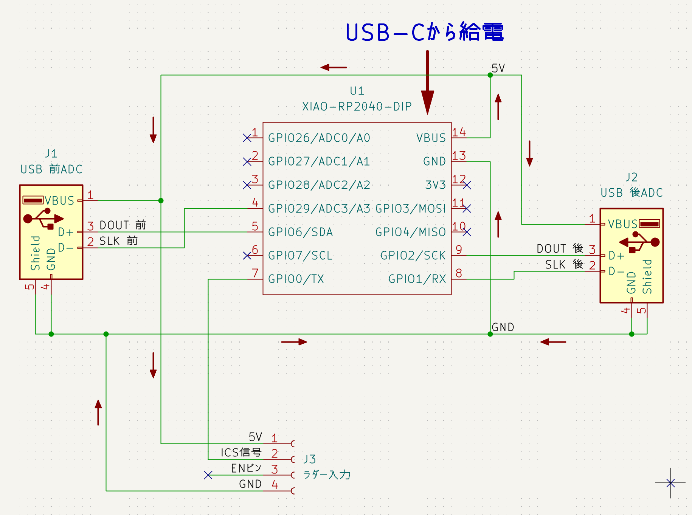
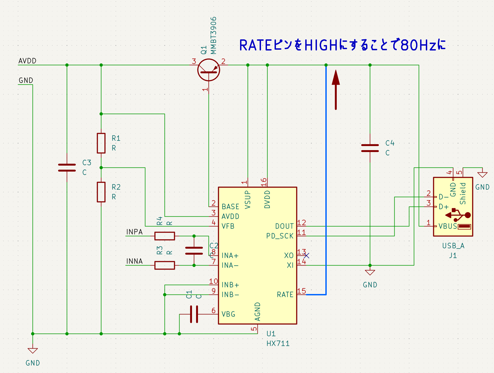

# 回路や接続について

## シリアルコントローラー
使用しているマイコンは`Seeed XIAO RP2040`です（端子がUSB-Cだったため採用）．  
わかりやすくした回路図を示します（矢印は電流が流れるとした場合の向き）．

||
|:--:|
|シリアルコントローラーの回路図|

## ADCモジュール
シリアルコントローラーとは`USB-A to A`ケーブルで接続します（誰が触っても壊しにくそうだったから）．秋葉原のあきばお～に売ってました．  

使用しているADC（アナログ・デジタルコンバーター）は`HX711`です．  
`HX711`から出てくる信号は`SCK`（クロック信号），`DOUT`（データ出力信号）の2つです．  
`USB-A`の信号線には`D+`（データプラス），`D-`（データマイナス）があるので，以下のように割り当てました．

|HX711|USB-A|
|:--:|:--:|
|DOUT|D+|
|SCK|D-|

ロードセルとの接続は次のようになっています．
|基板|AVDD|GND|INNA|INPA|
|:--:|:--:|:--:|:--:|:--:|
|ロードセル|EXC+(赤)|EXC-(黒)|SIG-(白)|SIG+(緑)|

この部分の接続に使用した中継コネクタはJST　SMコネクタ（[Amazonリンクその1](https://amzn.asia/d/03nIp4fM)，[Amazonリンクその2](https://amzn.asia/d/01rB3dXC)）です．  
秋月に売っていないことだけが残念...  
これを基板に取り付けるなら，電線が基板から剥がれないように工夫する必要があります（以下，例）．
||
|:--:|
|はんだに負荷のかかりにくいケーブルの通し方|

回路図はほとんど[秋月に売っているADCモジュール](https://akizukidenshi.com/catalog/g/g112370)と同じですが，`RATE`ピンのレベルが`HIGH`になっていることだけ違います．  
部品は全く同じか，同等品を自己調達しました．

||
|:--:|
|秋月に売っているADCモジュールの回路図と部品表|

||
|:--:|
|ADCモジュールの回路図|