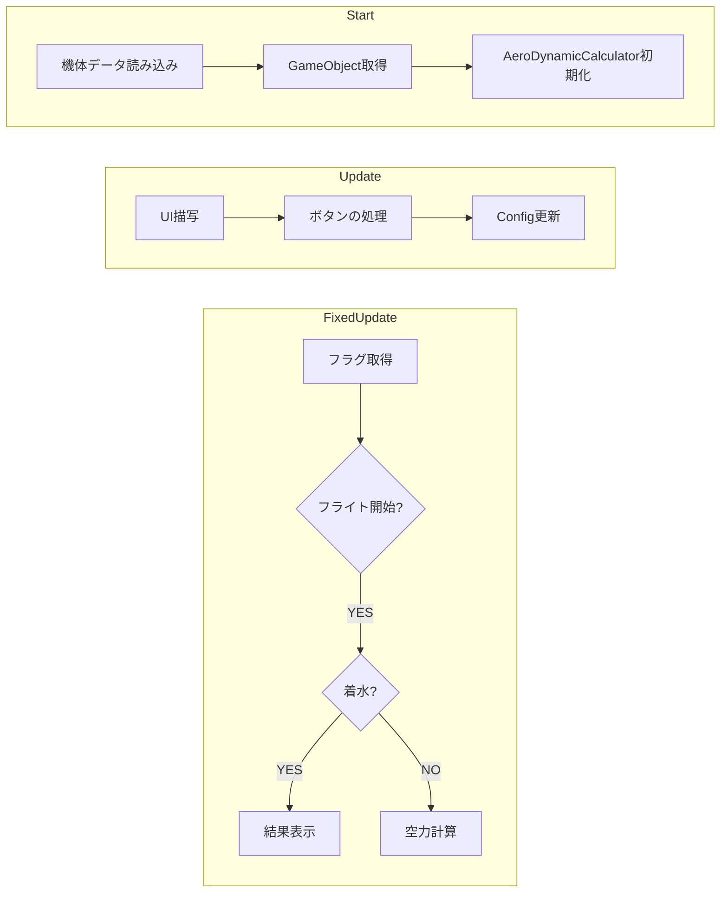

# v26でやったこと・やりたかったこと
## やったこと

### 重心センサーの全面改修
    

**目的**： 
より高強度（50kg → 120kg）で，断線しにくいケーブルの[ロードセル](https://akizukidenshi.com/catalog/g/g112035/)を使用すること．

**影響**： 
これを採用したことにより，ロードセルは前後に1つずつで良いことになった． 
しかしながら，フレームを支える部分にも同等の強度が必要になった．

**対応**： 
単管パイプ（工事現場の足場に用いられる）を組み合わせて，フレームを支えるT字型の構造を製作した．

---
### [定常確定ロジックの見直し](https://github.com/torica-org/simulator-docs/blob/main/custom-logic/%E5%AE%9A%E5%B8%B8%E7%8A%B6%E6%85%8B%E3%81%AE%E7%A2%BA%E5%AE%9A%E3%83%AD%E3%82%B8%E3%83%83%E3%82%AF%E3%81%AB%E3%81%A4%E3%81%84%E3%81%A6.md)
---
### [`UIClasses`の作成](https://github.com/torica-org/simulator-docs/blob/main/custom-logic/UIClasses%E3%81%AE%E4%BD%BF%E3%81%84%E6%96%B9.md)
---

### `Config.cs`によるパラメーターの管理

目的： 
- （変更が非常に煩雑な）UIに頼らず，ゲームの主要なパラメーターを調整できるようにすること．

---

### `CsvIO.cs`によるファイル読み書き

目的： 
- CSVファイル読み書き手段の統一

発展： 
- `AircraftData.cs`のクラス`AircraftData`は`CsvIO`を継承している．
- `ConfigIO.cs`のクラス`ConfigIO`は`CsvIO`を継承している．

---

 
 

## やりたかったこと

### `GameManager.cs`による包括的ゲーム進行

目的： 
処理の流れを明確にするため．

概要： 
`GameManager.cs`に以下のようなロジックを組み込む．
全てのスクリプトに含まれるクラスのインスタンスを持ち，全ての処理はここを起点に開始する．

懸念点： 
- 1つのゲームオブジェクトに対して1つのスクリプトを――というUnityの良さ(?)を台無しにする．
- 逆にわかりにくくなる可能性．
- C#スクリプト内でインスタンス化する場合，`MonoBehavior`を継承できなくなり，Unityのゲームオブジェクトにアタッチできなくなる（`using UnityEngine;`はできるので，ゲームオブジェクトの制御はできる）．

---

### `AeroDynamicCalculator.cs`の整理

目的： 
空力計算だけをさせたかった．

現状： 
- `InputSpecification()`のみ分化済（staticなクラス`AircraftData`が保持）．

展望： 
- 以下の事項も別クラスで管理したかった．
  - キーボードなどの`Input`関連処理
  - 空力計算以外でも使うパラメーター

---

### VRにおけるハンドトラッキング

目的： 
パイロットが一人でも楽に練習できるようにするため＋かっこいい

資料： 
<https://note.com/jigjp_engineer/n/na2059e919d5c>
<https://donabenabe.hatenablog.com/entry/TryXRHands>
<https://tech.framesynthesis.co.jp/unity/xr/#%E3%83%8F%E3%83%B3%E3%83%89%E3%83%88%E3%83%A9%E3%83%83%E3%82%AD%E3%83%B3%E3%82%B0%E3%82%92%E4%BD%BF%E7%94%A8%E3%81%99%E3%82%8B%E3%81%AB%E3%81%AF>

現状： 
- 正しくトラッキングするに至らなかった．

---
