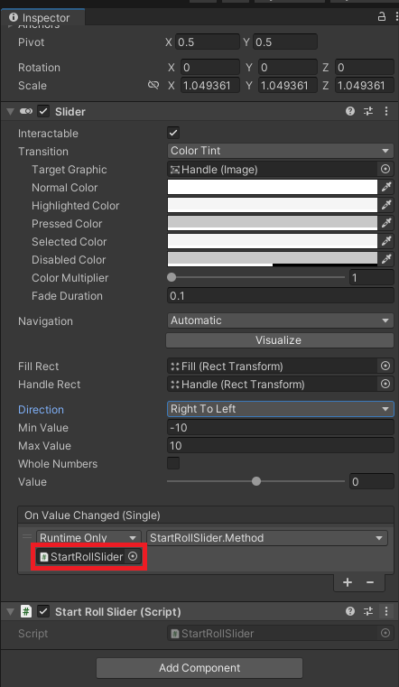

# Sliderについて



~~赤枠のところにドラッグ＆ドロップするのはオブジェクト（スライダー自体など）~~  
~~スクリプトではないことに注意~~

ドラッグ＆ドロップによるアタッチだと，アタッチが外れたときに見つけられなくなるおそれがある．
代わりに`Find`関数を用いて見つける．
```cs
GameObject something;

public class exampleClass:MonoBehaviour
{
    public GameObject something;
    
    void exampleMethod()
    {
        something = GameObject.Find("nameofSomething");
    }
}
```
`GetComponent`でコンポーネントを取得
```cs
using TMPro;

public class changeTextClass:MonoBehaviour
{
    public TMP_Text textOfSomething;

    void changeText()
    {
        textOfSomething = GameObject.Find("nameOfSomething").GetComponent<TMP_Text>();
    }
}
```
オブジェクトやコンポーネントはこれで取得できるが，実行のトリガーにはならないので予めオブジェクトのコンポーネントに（アタッチ）しなくてはならない．